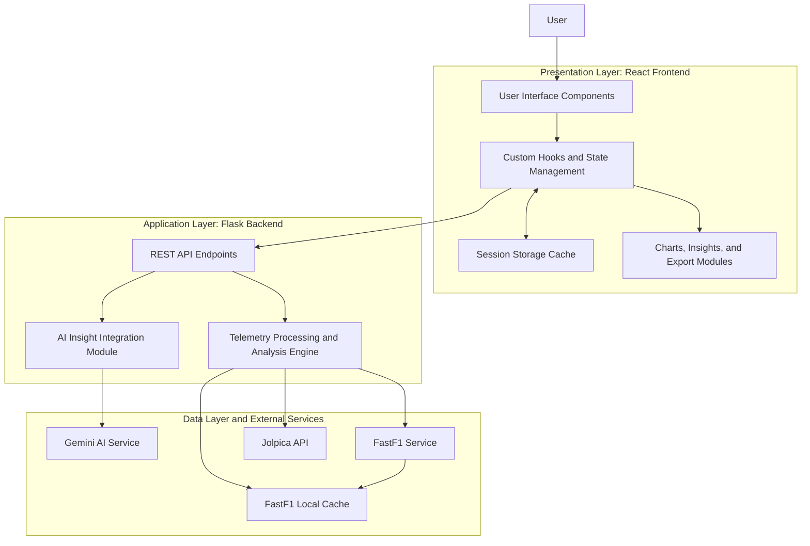

# F1 Telemetry Hub System Architecture Diagram

This version is formatted for academic documentation and report writing.

## Report Description

The system architecture of the F1 Telemetry Hub follows a layered client-server model composed of a React-based frontend, a Flask-based backend, and multiple external data services. The presentation layer is responsible for rendering the user interface, maintaining application state, displaying interactive charts, and supporting report export features. It also uses browser session storage to cache selected responses and reduce repeated API calls.

The application layer is implemented using a Flask backend that exposes REST API endpoints for standings retrieval, telemetry access, season progression, tire degradation analysis, weather correlation analysis, overtaking detection, and AI-based insight generation. This layer acts as the processing core of the system by transforming raw motorsport data into structured datasets suitable for visualization and interpretation.

The data layer includes external services and local caching support. The `Jolpica API` provides season standings and progression data, while the `FastF1 Service` supplies telemetry, race, lap, and weather-related data. A local FastF1 cache is maintained by the backend to improve retrieval efficiency. For advanced textual interpretation, the backend communicates with the `Gemini AI Service`, which generates natural-language insights from processed analytics results.

## Architectural Components

- `Presentation Layer`: React frontend containing pages, UI components, charts, export tools, and browser-side caching.
- `Application Layer`: Flask backend responsible for routing, data processing, analysis, and AI integration.
- `Data Layer`: external APIs and local cache used to supply raw and processed racing data.

## Data Flow Summary

- The `User` interacts with the React frontend through the dashboard interface.
- The frontend sends requests to Flask REST endpoints for telemetry and analytical data.
- The backend retrieves external data from `Jolpica API` and `FastF1 Service`.
- The backend processes and aggregates the data before returning structured JSON responses.
- When AI explanation is requested, the backend forwards summarized analytical data to the `Gemini AI Service`.
- Cached data is stored locally in both browser session storage and the FastF1 backend cache to improve responsiveness.

## Source Mapping

- Frontend entry and views: [src/App.jsx](/run/media/abing/Gaming/projects/f1-telemetry/src/App.jsx)
- Frontend data hooks: [src/hooks/useData.js](/run/media/abing/Gaming/projects/f1-telemetry/src/hooks/useData.js)
- Race comparison and export modules: [src/components/RaceData.jsx](/run/media/abing/Gaming/projects/f1-telemetry/src/components/RaceData.jsx)
- Analysis and AI integration trigger: [src/components/Analysis.jsx](/run/media/abing/Gaming/projects/f1-telemetry/src/components/Analysis.jsx), [src/components/InsightPanel.jsx](/run/media/abing/Gaming/projects/f1-telemetry/src/components/InsightPanel.jsx)
- Backend services and cache setup: [backend/server.py](/run/media/abing/Gaming/projects/f1-telemetry/backend/server.py)
